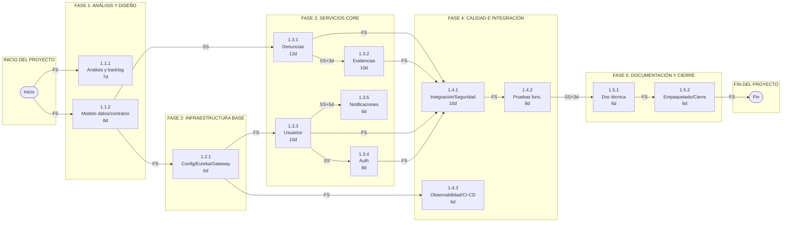
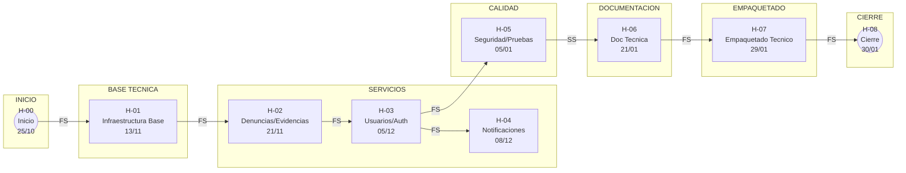
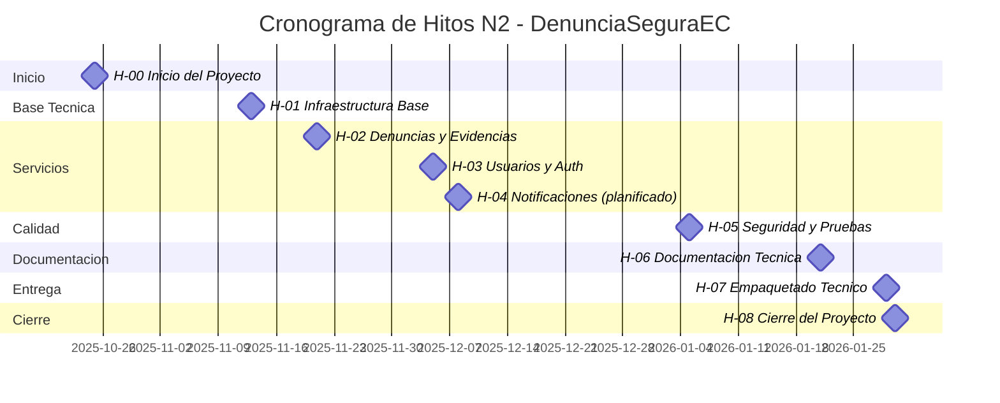
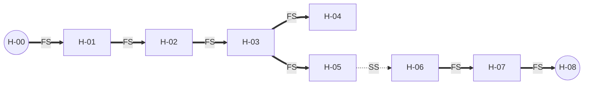

# Estimacion de tiempos por actividad

Supuestos clave: el cronograma inicia el **25-oct-2025**, considera semanas laborales de 5 dias (8 horas/dia) y holguras minimas, y concluye el **30-ene-2026** para cumplir con la fecha de cierre del proyecto.

## Resumen de duracion del proyecto
| Concepto | Valor |
|----------|-------|
| **Fecha de inicio** | 25-oct-2025 |
| **Fecha de fin estimada** | 30-ene-2026 |
| **Duracion total** | 70 dias habiles |
| **Horas de trabajo por dia** | 8 horas |
| **Total de horas del proyecto** | 560 horas |
| **Dias transcurridos (al 25-nov-2025)** | 22 dias habiles |
| **Dias restantes** | 48 dias habiles |
| **Horas trabajadas (estimado)** | 176 horas |
| **Horas restantes** | 384 horas |

## Notacion de Precedencia segun PMBOK

El Metodo de Diagramacion por Precedencia (PDM) utiliza los siguientes tipos de relaciones logicas:

| Tipo | Notacion | Descripcion |
|------|----------|-------------|
| **FS** | Finish-to-Start | La actividad sucesora inicia cuando la predecesora termina (mas comun) |
| **SS** | Start-to-Start | La actividad sucesora inicia cuando la predecesora inicia |
| **FF** | Finish-to-Finish | La actividad sucesora termina cuando la predecesora termina |
| **SF** | Start-to-Finish | La actividad sucesora termina cuando la predecesora inicia (poco comun) |

**Formato de precedencia:** `[Codigo actividad predecesora][Tipo de relacion]`  
**Ejemplo:** `1.3.4-FS` significa que la actividad inicia cuando termina la actividad 1.3.4

---

## Tabla de Estimacion con Precedencias

| Codigo | Actividad | Duracion (dias) | Horas | Inicio | Fin | Precedencia |
|--------|-----------|-----------------|-------|--------|-----|-------------|
| 1.0 | DenunciaSeguraEC | 70 | 560 | 25-oct-2025 | 30-ene-2026 | — |
| 1.1.1 | Analisis y backlog | 7 | 56 | 25-oct-2025 | 04-nov-2025 | — |
| 1.1.2 | Modelo de datos y contratos API | 8 | 64 | 25-oct-2025 | 05-nov-2025 | — |
| 1.2.1 | Infraestructura base (config/eureka/gateway) | 6 | 48 | 06-nov-2025 | 13-nov-2025 | 1.1.2-FS |
| 1.3.1 | Servicio denuncias | 12 | 96 | 06-nov-2025 | 21-nov-2025 | 1.1.2-SS |
| 1.3.2 | Servicio evidencias | 10 | 80 | 10-nov-2025 | 21-nov-2025 | 1.3.1-SS+3d |
| 1.3.3 | Servicio usuarios (pendiente) | 10 | 80 | 24-nov-2025 | 05-dic-2025 | 1.2.1-FS |
| 1.3.4 | Servicio auth (pendiente) | 8 | 64 | 24-nov-2025 | 03-dic-2025 | 1.3.3-SS |
| 1.3.5 | Servicio notificaciones (planificado) | 6 | 48 | 01-dic-2025 | 08-dic-2025 | 1.3.3-SS+5d |
| 1.4.1 | Integracion y seguridad | 10 | 80 | 09-dic-2025 | 22-dic-2025 | 1.3.1-FS, 1.3.2-FS, 1.3.3-FS, 1.3.4-FS |
| 1.4.2 | Pruebas funcionales y regresion | 8 | 64 | 23-dic-2025 | 05-ene-2026 | 1.4.1-FS |
| 1.4.3 | Observabilidad y CI/CD | 6 | 48 | 06-ene-2026 | 13-ene-2026 | 1.2.1-FS |
| 1.5.1 | Documentacion tecnica | 6 | 48 | 14-ene-2026 | 21-ene-2026 | 1.4.2-SS+3d |
| 1.5.2 | Empaquetado y cierre | 6 | 48 | 22-ene-2026 | 30-ene-2026 | 1.5.1-FS |

---

## Diagrama de Red PDM (Precedence Diagramming Method)

El siguiente diagrama muestra las relaciones de precedencia entre actividades segun la notacion PMBOK. Cada nodo representa una actividad con su codigo EDT.

---

## Leyenda del Diagrama PDM

| Elemento | Significado |
|----------|-------------|
| `-->│FS│` | Finish-to-Start: La sucesora inicia cuando termina la predecesora |
| `-->│SS│` | Start-to-Start: La sucesora inicia cuando inicia la predecesora |
| `-->│FF│` | Finish-to-Finish: La sucesora termina cuando termina la predecesora |
| `-->│SS+Xd│` | Start-to-Start con adelanto/retraso de X dias |
| Rectangulo | Actividad con codigo EDT, nombre y duracion |
| Circulo | Hito de inicio o fin del proyecto |

---

## Ruta Critica (Actividades sin Holgura)

Basado en el analisis de precedencias, la **ruta critica** del proyecto incluye las siguientes actividades:

| Secuencia | Actividad | Duracion | Acumulado |
|-----------|-----------|----------|-----------|
| 1 | 1.1.2 Modelo de datos y contratos API | 8d | 8d |
| 2 | 1.3.1 Servicio denuncias | 12d | 20d |
| 3 | 1.3.3 Servicio usuarios | 10d | 30d |
| 4 | 1.4.1 Integracion y seguridad | 10d | 40d |
| 5 | 1.4.2 Pruebas funcionales | 8d | 48d |
| 6 | 1.5.1 Documentacion tecnica | 6d | 54d |
| 7 | 1.5.2 Empaquetado y cierre | 6d | 60d |

> **Nota:** Las actividades en la ruta critica no tienen holgura. Cualquier retraso en estas actividades impactara directamente la fecha de fin del proyecto.

---

## Tabla de Hitos del Proyecto

Segun la guia PMBOK, los hitos son eventos significativos que marcan la finalizacion de entregables clave del proyecto. No tienen duracion (duracion = 0) y representan puntos de control para verificar el cumplimiento de los productos del trabajo.

Los hitos de este proyecto corresponden a los **entregables N2** definidos para los servicios y etapas de cierre, mas los hitos de inicio y cierre.

### Clasificacion de Hitos segun PMBOK

- **Hitos Obligatorios (Mandatorios):** Vinculados a entregables contractuales, restricciones legales o dependencias tecnicas ineludibles. Su incumplimiento detiene el avance del proyecto.
- **Hitos Opcionales (Discrecionales):** Basados en mejores practicas o preferencias del equipo. Facilitan el control pero pueden ajustarse sin afectar compromisos contractuales.

### Leyenda

| Simbolo | Tipo | Descripcion |
|---------|------|-------------|
|  | **Obligatorio** | Entregable contractual o restriccion mandatoria |
|  | **Opcional** | Entregable de seguimiento o buena practica |

---

## Tabla de Hitos (Entregables N2)

| ID | Hito | Fecha | Tipo | Entregable N2 | Paquetes Incluidos | Criterio de Aceptacion | Precedencia |
|----|------|-------|------|---------------|-------------------|------------------------|-------------|
| **H-00** | Inicio del Proyecto | 25/10/2025 |  Obligatorio | Acta de Constitucion aprobada | — | Firma del patrocinador | — |
| **H-01** | Infraestructura Base | 13/11/2025 |  Obligatorio | 1.2 Infraestructura Base | 1.2.1 | Config server, Eureka y Gateway operativos | H-00-FS |
| **H-02** | Servicios Denuncias y Evidencias | 21/11/2025 |  Obligatorio | 1.3 Servicios Core (Denuncias/Evidencias) | 1.3.1, 1.3.2 | Endpoints base funcionales | H-01-FS |
| **H-03** | Servicios Usuarios y Auth | 05/12/2025 |  Obligatorio | 1.3 Servicios Core (Usuarios/Auth) | 1.3.3, 1.3.4 | Flujos de registro/autenticacion operativos | H-02-FS |
| **H-04** | Servicio Notificaciones | 08/12/2025 |  Opcional | 1.3 Servicio Notificaciones | 1.3.5 | Diseno e integracion base definida | H-03-FS |
| **H-05** | Seguridad y Pruebas Integradas | 05/01/2026 |  Obligatorio | 1.4 Calidad e Integracion | 1.4.1, 1.4.2 | Pruebas funcionales OK, controles basicos | H-03-FS |
| **H-06** | Documentacion Tecnica | 21/01/2026 |  Obligatorio | 1.5 Documentacion | 1.5.1 | Documentacion versionada y revisada | H-05-SS |
| **H-07** | Empaquetado Tecnico | 29/01/2026 |  Obligatorio | 1.5 Empaquetado y Cierre | 1.5.2 | Paquete tecnico listo para entrega | H-06-FS |
| **H-08** | Cierre del Proyecto | 30/01/2026 |  Obligatorio | Acta de cierre y transferencia | 1.5.2 | Aceptacion formal del patrocinador | H-07-FS |

---

## Resumen por Clasificacion

| Clasificacion | Cantidad | Porcentaje |
|---------------|----------|------------|
|  **Hitos Obligatorios** | 8 | 88.9% |
|  **Hitos Opcionales** | 1 | 11.1% |
| **Total** | 9 | 100% |

---

## Diagrama de Hitos con Precedencias (PDM)

---

## Linea de Tiempo de Hitos

## Precedencias entre Hitos

**Leyenda:** `==>` FS (Finish-to-Start) | `-.->` SS (Start-to-Start)

---

## Descripcion de Precedencias entre Hitos

| Relacion | Tipo | Descripcion |
|----------|------|-------------|
| H-00 -> H-01 | FS | Infraestructura base inicia tras aprobar el ACP |
| H-01 -> H-02 | FS | Denuncias y Evidencias requieren base tecnica activa |
| H-02 -> H-03 | FS | Usuarios y Auth se integran con servicios core |
| H-03 -> H-04 | FS | Notificaciones dependen de identidad y usuarios |
| H-03 -> H-05 | FS | Pruebas integradas requieren servicios core completos |
| H-05 -> H-06 | SS | Documentacion avanza en paralelo a pruebas |
| H-06 -> H-07 | FS | Empaquetado requiere documentacion completa |
| H-07 -> H-08 | FS | Cierre requiere paquete tecnico entregado |

---

## Notas segun PMBOK

1. **Hitos = Entregables N2:** Cada hito corresponde a un entregable final del nivel 2 de la EDT, representando productos tangibles del proyecto.
2. **Duracion Cero:** Los hitos no tienen duracion; marcan el punto de finalizacion de los paquetes de trabajo que los componen.
3. **Precedencias PDM:** Las relaciones Finish-to-Start (FS) y Start-to-Start (SS) definen el orden logico entre entregables.
4. **Hito Opcional (H-04):** Notificaciones se mantiene como habilitador planificado y su fecha puede ajustarse sin afectar el cierre.
5. **Monitoreo:** Los hitos deben registrarse en Azure DevOps como Work Items tipo "Milestone" y reportarse en el Comite Directivo quincenal.